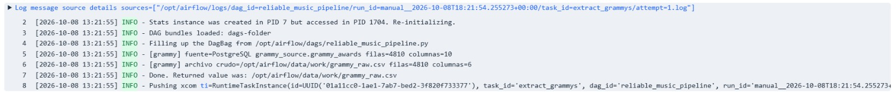
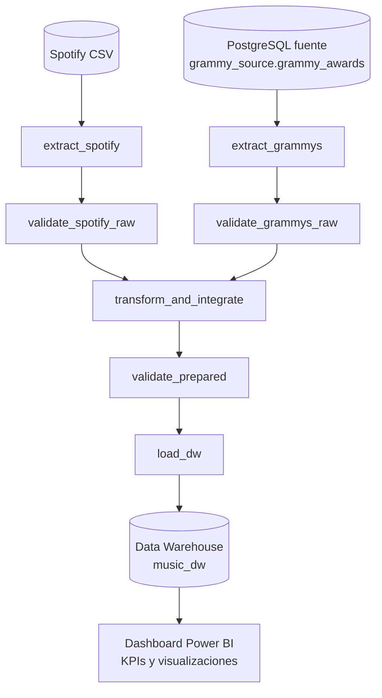
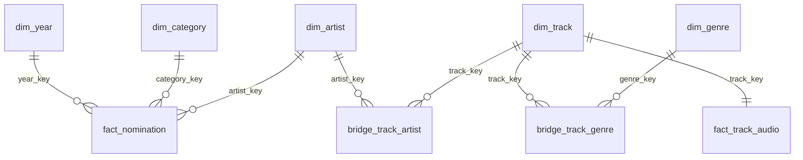
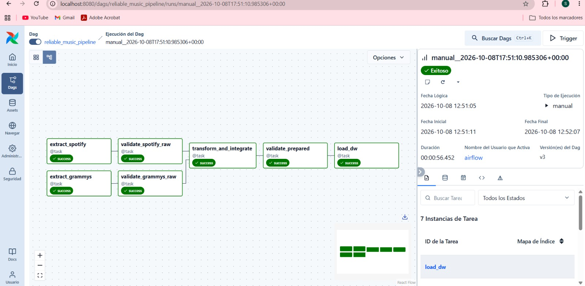
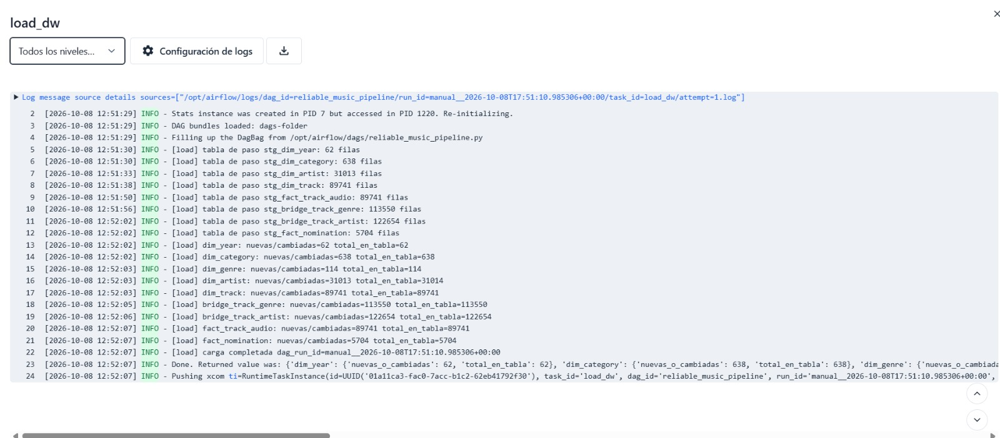
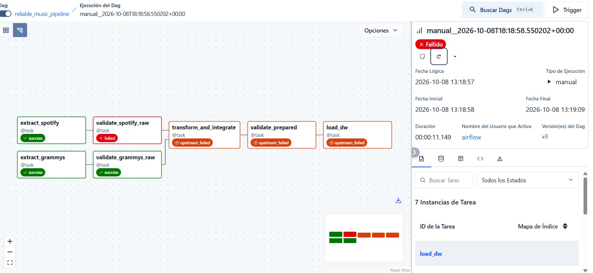
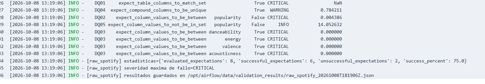
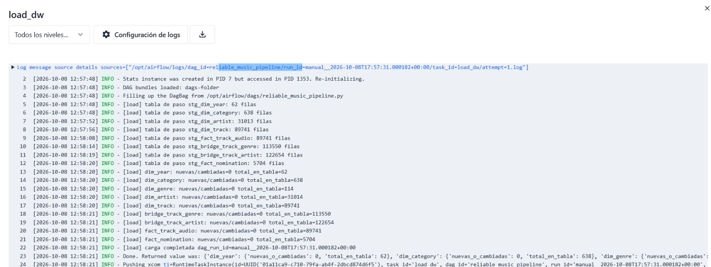

# Workshop-2: Pipeline batch confiable Spotify + Grammy

Pipeline batch orquestado con **Apache Airflow 3.1.8 (TaskFlow API)**, validado con **Great Expectations** en dos compuertas (datos crudos y datos preparados) y cargado en un **Data Warehouse dimensional en PostgreSQL** (`music_dw`). Un dashboard en Power BI consulta el DW directamente.

> Curso ETL / Ingeniería de Datos e IA, Universidad Autónoma de Occidente.
> Autor: **Samuel Arboleda**

## Índice

1. [Problema y objetivo analítico](#1-problema-y-objetivo-analítico)
2. [Requerimientos analíticos](#2-requerimientos-analíticos)
3. [Fuentes de datos](#3-fuentes-de-datos)
4. [Arquitectura del pipeline](#4-arquitectura-del-pipeline)
5. [Hallazgos del profiling](#5-hallazgos-del-profiling)
6. [Riesgos de calidad y reglas de calidad](#6-riesgos-de-calidad-y-reglas-de-calidad)
7. [Diseño de validación con Great Expectations](#7-diseño-de-validación-con-great-expectations)
8. [Estrategia de transformación e integración](#8-estrategia-de-transformación-e-integración)
9. [Modelo dimensional](#9-modelo-dimensional)
10. [Diseño del DAG de Airflow](#10-diseño-del-dag-de-airflow)
11. [Política de fallos y reintentos](#11-política-de-fallos-y-reintentos)
12. [Evidencia de ejecución exitosa (Test A)](#12-evidencia-de-ejecución-exitosa-test-a)
13. [Evidencia de fallo controlado (Test B)](#13-evidencia-de-fallo-controlado-test-b)
14. [Estrategia de repetibilidad (rerun seguro)](#14-estrategia-de-repetibilidad-rerun-seguro)
15. [Dashboard y salidas analíticas](#15-dashboard-y-salidas-analíticas)
16. [Instrucciones de instalación y ejecución](#16-instrucciones-de-instalación-y-ejecución)
17. [Supuestos y limitaciones](#17-supuestos-y-limitaciones)

Anexos: [A. Trazabilidad](#anexo-a-matriz-de-trazabilidad-extremo-a-extremo) · [B. Registro de evidencia](#anexo-b-registro-de-evidencia-de-confiabilidad) · [C. Evidencia mínima](#anexo-c-conjunto-mínimo-de-evidencia)

---

## 1. Problema y objetivo analítico

**Problema.** Los datos de audio y popularidad de canciones (Spotify) y los datos de nominaciones a los premios Grammy viven en fuentes heterogéneas (un CSV y una base relacional) y no comparten una clave común. Para responder preguntas que cruzan ambas fuentes hace falta integrarlas con reglas explícitas y verificar su calidad antes de analizarlas.

**Objetivo.** Construir un pipeline batch **confiable**, no un conjunto de scripts: que verifique los datos en la entrada y antes de cargar, que falle de forma controlada y observable, que se pueda repetir sin duplicar efectos, y que alimente un Data Warehouse dimensional del cual salen los KPIs.

**Alcance.** Incluye extracción de ambas fuentes, validación cruda, transformación e integración, validación de datos preparados, carga al DW y un dashboard con 3 KPIs y 3 visualizaciones. No incluye programación periódica (el DAG se dispara manualmente, `schedule=None`) ni carga incremental entre lotes distintos: el DW se carga de forma idempotente a partir del lote completo.

**Principio de diseño.** La validación detecta y mide; la transformación aplica reglas de ingeniería conocidas. Ninguna transformación se hizo solo para que una validación pase.

---

## 2. Requerimientos analíticos

Cada requerimiento exige información de **ambas** fuentes: popularidad y audio vienen de Spotify; la nominación viene de Grammy.

| ID | Requerimiento analítico | Fuente(s) de datos requeridas | KPI(s) esperado(s) | Nivel de detalle requerido |
|---|---|---|---|---|
| **R1** | Popularidad en Spotify según si el artista fue nominado a un Grammy | Spotify: `popularity`, `track_id`, `artists`. Grammy: artista nominado | Popularidad promedio de canciones de artistas nominados y de no nominados | Canción (única por `track_id`), agrupada por estatus Grammy del artista |
| **R2** | Perfil de audio de artistas nominados vs. no nominados, por género y estatus Grammy | Spotify: `danceability`, `energy`, `valence`, `acousticness`, `track_genre`. Grammy: artista nominado | Promedio de cada característica de audio por estatus Grammy y género | Canción × género × estatus Grammy del artista |
| **R3** | Nominaciones por categoría (Grammy) distribuidas por género (Spotify) | Grammy: categoría, nominación, artista. Spotify: `track_genre` de las canciones del artista | Nominaciones distintas por categoría y género | Nominación × categoría × género |

**Declaración de alcance.** Los resultados de R1 y R2 describen únicamente artistas presentes en **ambas** fuentes; R3 describe nominaciones cuyo artista tiene canciones en Spotify. Las nominaciones se cuentan con `COUNT(DISTINCT nomination_id)`, no con el número de filas de la tabla de hechos. La cobertura del cruce y sus consecuencias se documentan en §8 y §17.

**¿Por qué se necesitan ambas fuentes?** Spotify no sabe qué artistas fueron nominados, y Grammy no tiene audio ni popularidad. Solo la integración por artista permite comparar.

**Trazabilidad.** Cada requerimiento se enlaza con riesgos, reglas, expectations, transformaciones y salidas del DW en el [Anexo A](#anexo-a-matriz-de-trazabilidad-extremo-a-extremo).

---

## 3. Fuentes de datos

| Fuente | Forma entregada | Fuente de extracción del pipeline | Observaciones |
|---|---|---|---|
| **Spotify** | Archivo CSV (`data/raw/spotify_dataset.csv`) | El mismo CSV, leído por `extract_spotify` | 114 000 filas (una por combinación canción-género), 89 741 canciones y 114 géneros |
| **Grammy Awards** | Archivo CSV entregado (`the_grammy_awards.csv`) | **Base de datos PostgreSQL fuente** (`grammy_source`), tabla `grammy_awards`, leída por `extract_grammys` con `SELECT * FROM grammy_awards` | La carga del CSV a la base es preparación de la fuente, **no** el Load del ETL |

**Evidencia de que el Grammy se extrae de la base y no del CSV.** `extract_grammys()` usa `pd.read_sql("SELECT * FROM grammy_awards", _grammy_engine())`; la conexión apunta a PostgreSQL (`data-db`, base `GRAMMY_DB_NAME`) y la tarea registra `[grammy] fuente=PostgreSQL ...` en su log. El CSV del Grammy no se abre en ningún punto del DAG.



**Preparación de la fuente Grammy.** El script [`sql/source_setup.sql`](sql/source_setup.sql) elimina y crea la tabla `grammy_awards` (10 columnas del CSV original: `year`, `title`, `published_at`, `updated_at`, `category`, `nominee`, `artist`, `workers`, `img`, `winner`), carga el CSV con `COPY` y muestra el conteo de filas. Los archivos originales se conservan sin modificar. Conciliación: **4 810 filas en el CSV = 4 810 filas en la tabla**.

**Servidores y bases.** Un solo contenedor PostgreSQL 16 de datos (`data-db`, puerto `5433` en el equipo local) con **dos bases de datos**: `grammy_source` (fuente operacional) y `music_dw` (Data Warehouse analítico). Airflow usa un PostgreSQL aparte para sus metadatos.

---

## 4. Arquitectura del pipeline



El DAG preserva las dos ramas de fuente, las dos compuertas de validación, la dependencia de integración, la carga dimensional y el destino analítico.

**Infraestructura (Docker Compose).** Airflow 3.1.8 con CeleryExecutor y Redis, imagen propia `workshop2-airflow:3.1.8` (construida desde `apache/airflow:3.1.8` con `requirements.txt`), PostgreSQL de metadatos de Airflow y PostgreSQL de datos (`data-db`). Las carpetas `dags/`, `src/` y `data/` se montan como volúmenes y `PYTHONPATH` apunta a `src/`.

**Flujo de datos entre tareas.** Las tareas intercambian **rutas de archivos** y metadatos compactos, nunca datos voluminosos por XCom. Los archivos intermedios viven en `data/work/` (crudos), `data/work/prepared/` (preparados) y `data/validation_results/` (resultados JSON de Great Expectations).

**Separación de responsabilidades.**

| Carpeta / archivo | Responsabilidad |
|---|---|
| `dags/reliable_music_pipeline.py` | Solo estructura del flujo, dependencias y política de reintentos |
| `src/settings.py` | Rutas y columnas esperadas |
| `src/extract.py` | Extracción de Spotify (CSV) y Grammy (PostgreSQL) |
| `src/validation.py` | Expectations, suites, compuertas y guardado de resultados |
| `src/transform.py` | Limpieza, normalización e integración |
| `src/load.py` | Carga al DW con upsert, comprobación de huérfanos y auditoría |
| `src/reset_dw.py` | Utilidad para dejar el DW vacío en las pruebas |
| `sql/init_databases.sql`, `source_setup.sql`, `dw_schema.sql` | Creación de `music_dw`, preparación de la fuente Grammy y esquema estrella |
| `notebooks/data_profiling.ipynb` | Profiling reproducible de ambas fuentes |
| `docs/` | Reglas de calidad, evidencia y diagramas |

Diagrama conceptual en herramienta de diagramado: **[COMPLETAR si lo agregas: `docs/architecture.*`]**.

---

## 5. Hallazgos del profiling

El profiling se hizo **antes** de definir reglas y sin alterar los datos. Es reproducible en [`notebooks/data_profiling.ipynb`](notebooks/data_profiling.ipynb); las tablas resultantes están en `docs/evidence/profiling_*.csv`.

| ID | Dataset / atributo | Evidencia de profiling | Riesgo de calidad | Req. |
|---|---|---|---|---|
| RK01 | Spotify / `track_id` | 89 741 ids en 114 000 filas; 40 900 filas con id repetido | Contar una canción varias veces (una por género) | R1, R2 |
| RK02 | Spotify / `(track_id, track_genre)` | 450 filas duplicadas exactas | Doble conteo | R1–R3 |
| RK03 | Spotify / `(artists, track_name)` | 4 657 pares con más de un `track_id` | La misma canción con distinto id no se detecta | R1, R2 |
| RK04 | Spotify / `popularity` | 16 020 filas con valor 0 (14.05 %) | Ceros que pueden ser ausencia de dato y sesgan el promedio | R1 |
| RK05 | Spotify / `time_signature`, `tempo` | 1 136 filas con compás 0 o 1; 157 con tempo 0 | Valores fuera de dominio | R2 |
| RK06 | Spotify / `duration_ms` | 17 pistas de menos de 30 s; 81 de más de 20 min | Atípicos | R2 |
| RK07 | Spotify / `artists` | 30 075 filas (26.4 %) con varios artistas separados por `;` | Un artista por fila no coincide con Grammy | R1–R3 |
| RK08 | Grammy / `artist` | 1 840 nulos (38.25 %); 186 con `workers` también nulo | Nominaciones sin clave de integración | R1, R3 |
| RK09 | Grammy / `winner` | `True` en las 4 810 filas | No se distinguen ganadores de nominados | R1–R3 |
| RK10 | Grammy / `artist` | Separadores `&`, `,`, `Featuring`, `and` | Dividir mal rompe nombres de bandas | R1–R3 |
| RK11 | Cruce de fuentes | 32.81 % de artistas por nombre completo; 51.39 % por nombre o partes (profiling inicial) | Cobertura limitada y falsos "no nominados" | R1–R3 |
| RK12 | Spotify / muestra | Exactamente 1 000 filas por género | Los conteos de canciones por género no representan el mercado | R3 |

Archivos de apoyo en `docs/evidence/`: `profiling_spotify_structure.csv`, `profiling_spotify_track_grain.csv`, `profiling_spotify_uniqueness.csv`, `profiling_spotify_numeric.csv`, `profiling_spotify_range_checks.csv`, `profiling_spotify_time_signature.csv`, `profiling_spotify_genre.csv`, `profiling_spotify_explicit.csv`, `profiling_grammy_structure.csv`, `profiling_grammy_uniqueness.csv`, `profiling_grammy_category_top15.csv`, `profiling_grammy_artist_null_by_category.csv`, `profiling_artist_recoverable.csv`, `profiling_artist_separators.csv` y `profiling_artist_match.csv`.

---

## 6. Riesgos de calidad y reglas de calidad

El detalle y las justificaciones de umbral están en [`docs/quality_rules.md`](docs/quality_rules.md). Resumen de las **14 reglas**:

| ID | Capa | Atributo(s) | Dimensión de calidad | Regla | Métrica / Umbral | Severidad | Riesgo | Req. |
|---|---|---|---|---|---|---|---|---|
| DQ01 | Raw Spotify | columnas requeridas | Completitud | Existen `track_id`, `artists`, `track_genre`, `popularity` y los campos de audio | 100 % | **Critical** | contrato de fuente | R1–R3 |
| DQ02 | Raw Spotify | `popularity` | Validez | Valores entre 0 y 100 | 100 % | **Critical** | RK04 | R1 |
| DQ03 | Raw Spotify | `danceability`, `energy`, `valence`, `acousticness` | Validez | Valores entre 0 y 1 | 100 % (una expectation por columna) | **Critical** | RK05 | R2 |
| DQ04 | Raw Spotify | `(track_id, track_genre)` | Unicidad | Filas únicas | ≥ 99 % | Warning | RK02 | R1–R3 |
| DQ05 | Raw Spotify | `popularity` | Validez | Proporción de ceros | Solo se registra | Informational | RK04 | R1 |
| DQ06 | Raw Grammy | columnas requeridas | Completitud | Existen `year`, `category`, `nominee`, `artist`, `workers` | 100 % | **Critical** | contrato de fuente | R1, R3 |
| DQ07 | Raw Grammy | `category` | Completitud | No nula | 100 % | **Critical** | RK09 | R3 |
| DQ08 | Raw Grammy | `artist`, `workers` | Completitud | Al menos uno presente | ≥ 95 % | Warning | RK08 | R1, R3 |
| DQ09 | Raw Grammy | `winner` | Consistencia | Contiene `True` y `False` | Solo se registra | Informational | RK09 | R1–R3 |
| DQ10 | Prepared | clave de artista | Completitud | No nula en las nominaciones con artista asignado | 100 % | **Critical** | RK08, RK10 | R1, R3 |
| DQ11 | Prepared | dimensión de artista | Unicidad | Clave normalizada única | 100 % | **Critical** | RK07, RK10 | R1–R3 |
| DQ12 | Prepared | hechos de nominación | Consistencia | Nominaciones distintas en hechos = filas crudas de Grammy | 100 % | **Critical** | RK08 | R3 |
| DQ13 | Prepared | cruce Grammy–Spotify | Consistencia | Proporción de artistas de Grammy con coincidencia en Spotify | ≥ 40 % | Warning | RK11 | R1–R3 |
| DQ14 | Prepared | cruce Grammy–Spotify | Unicidad | Cada artista de Grammy se asocia a una sola clave en la dimensión de artista (sin coincidencias ambiguas) | 100 % | **Critical** | RK10, RK11 | R1–R3 |

**Política por severidad.**

| Severidad | Significado | Respuesta del pipeline |
|---|---|---|
| Critical | La violación hace inseguro continuar o cargar | Bloquea la ruta afectada (la compuerta lanza error) |
| Warning | Requiere visibilidad pero no invalida el lote | Se registra y expone el resultado; el flujo continúa bajo la política documentada |
| Informational | Contexto de monitoreo | Se registra; no bloquea |

**Sobre DQ13.** El umbral se mantiene en 40 % tras medir la coincidencia real: **34.28 %** (822 de 2 398 artistas de Grammy con coincidencia en Spotify). Por eso la regla emite un **Warning en cada ejecución**. Se acepta como limitación conocida del dataset de Spotify y **no se baja el umbral para que pase**. Como dato de contexto, el 49 % de las nominaciones con artista identificado tiene un artista presente en Spotify. DQ09 también falla a propósito en cada lote (`winner` es siempre `True`) para dejar constancia.

---

## 7. Diseño de validación con Great Expectations

**Contexto efímero.** `gx.get_context(mode="ephemeral")`: el contexto se construye en memoria en cada compuerta y no escribe configuración en disco, así que `src/validation.py` es la única fuente de verdad de las reglas y se versiona en Git. La evidencia de cada ejecución se persiste en JSON (`data/validation_results/`). Es una decisión de diseño: un contexto en archivos también sería viable, con una carpeta `gx/` montada como volumen.

| Elemento GX | Cómo se implementa aquí |
|---|---|
| **Expectation** | Cada `E.Expect...` de `validation.py`, con `meta={"rule_id": "DQxx"}` y `severity` |
| **Expectation Suite** | Una por etapa: `raw_spotify_suite`, `raw_grammy_suite`, `prepared_artist_suite`, `prepared_nomination_suite` |
| **Validation Definition** | `{etapa}_validation`: une el batch (`{etapa}_batch`, del asset `{etapa}_asset`) con su suite |
| **Checkpoint / ejecución controlada** | La función `_gate`: ejecuta la validación, guarda el JSON, imprime el resumen y aplica la política (Critical lanza `ValueError` y bloquea; Warning e Info continúan) |
| **Resultado de validación** | JSON con éxito global, estadísticas, severidad máxima de fallo y, por regla: `rule_id`, expectation, columna, éxito, severidad y % inesperado |

### Mapeo de cada Expectation a su Rule ID

18 expectations implementan las 14 reglas.

| Suite | Rule ID | Expectation de GX | Columna | Severidad |
|---|---|---|---|---|
| raw_spotify | DQ01 | `ExpectTableColumnsToMatchSet` | (tabla) | Critical |
| raw_spotify | DQ02 | `ExpectColumnValuesToBeBetween` | `popularity` | Critical |
| raw_spotify | DQ03 (×4) | `ExpectColumnValuesToBeBetween` | `danceability`, `energy`, `valence`, `acousticness` | Critical |
| raw_spotify | DQ04 | `ExpectCompoundColumnsToBeUnique` (`mostly=0.99`) | `track_id`, `track_genre` | Warning |
| raw_spotify | DQ05 | `ExpectColumnValuesToNotBeInSet` (`mostly=0.9`) | `popularity` | Info |
| raw_grammy | DQ06 | `ExpectTableColumnsToMatchSet` | (tabla) | Critical |
| raw_grammy | DQ07 | `ExpectColumnValuesToNotBeNull` | `category` | Critical |
| raw_grammy | DQ08 | `ExpectColumnValuesToBeInSet` (`mostly=0.95`) | `has_artist_info` (auxiliar) | Warning |
| raw_grammy | DQ09 | `ExpectColumnDistinctValuesToContainSet` | `winner` | Info |
| prepared_artist | DQ11 | `ExpectColumnValuesToBeUnique` | `artist_norm` | Critical |
| prepared_artist | DQ13 | `ExpectColumnValuesToBeInSet` (`mostly=0.40`) | `matches_spotify` | Warning |
| prepared_nomination | DQ10 (×2) | `ExpectColumnValuesToNotBeNull` + `ExpectColumnValuesToBeInSet` | `artist_norm`, `artist_in_dim` | Critical |
| prepared_nomination | DQ12 | `ExpectColumnUniqueValueCountToBeBetween` | `nomination_id` | Critical |
| prepared_nomination | DQ14 | `ExpectColumnValuesToBeBetween` | `dim_matches` | Critical |

**Resultados conservados.** Los resultados JSON de cada ejecución se guardan en `data/validation_results/`. Ejemplo real de una compuerta preparada: DQ11 pasa (0 % inesperado), DQ13 falla como Warning (65.72 % sin coincidencia), y DQ10, DQ12 y DQ14 pasan. La corrida fallida del Test B queda en el log y el JSON de `validate_spotify_raw` (ver §13). **[COMPLETAR: copiar los JSON elegidos a `docs/evidence/` y enlazarlos aquí]**.

---

## 8. Estrategia de transformación e integración

`transform_and_integrate` es **una sola fase** de ingeniería (no una etapa de "limpieza" aparte para reparar validaciones). Cada decisión se justifica por evidencia de profiling o por un requerimiento, no por el resultado de una validación.

### Registro de decisiones de transformación

| Decisión | Regla y justificación | Campos afectados | Antes / después | Manejo de excepciones | Impacto analítico |
|---|---|---|---|---|---|
| Una fila por canción | RK01: el grano analítico es la canción (`track_id`), no canción-género | `track_id`, `popularity`, audio | 114 000 filas → 89 741 canciones únicas | Si una canción tiene popularidades distintas entre géneros se conserva la **máxima** | R1, R2 |
| Géneros como relación muchos a muchos | Una canción puede tener varios géneros | `track_genre` | Se extrae a `dim_genre` y `bridge_track_genre`; pares repetidos (RK02) se eliminan | — | R2, R3 |
| Separar artistas de Spotify | RK07: `artists` contiene varios nombres con `;` | `artists` | `"A;B"` → dos artistas | Un valor vacío no genera artista | R1–R3 |
| Normalizar nombre de artista | Permite emparejar variantes de escritura | `artist_norm` | Minúsculas, sin tildes ni puntuación, espacios colapsados, sin "the" inicial | Si queda vacío, se descarta | Clave de integración |
| Separar artistas de Grammy | RK10: `artist` mezcla `;`, `&` y `feat.`/`featuring` | `artist` | Una fila por artista acreditado | **No** se separa por coma ni por "and" (ambiguos: romperían nombres de bandas); limitación declarada | R3 (grano: artista acreditado) |
| Quitar sufijos de rol | `, conductor`, `, soloist`, `, producer`... no son parte del nombre | `artist` | `"Nombre, conductor"` → `"Nombre"` | Si no hay nombre se conserva el texto | Mejora el cruce |
| Recuperar artista ausente | RK08: 1 840 nulos; `workers` o el nominado (categoría *Best New Artist*) pueden contenerlo | `artist`, `workers`, `nominee` | Se intenta: artista → paréntesis de `workers` → nominado de *Best New Artist* | Si no se recupera, la nominación va a "Desconocido" (`artist_source = unknown`) | R3 (no se pierden nominaciones) |
| "Various Artists" → desconocido | No es un artista individual | `artist` | → "Desconocido" | — | Evita un artista falso |
| Placeholder "Desconocido" | Toda nominación debe tener `artist_key` | `dim_artist` | `artist_norm = __unknown__`, `is_placeholder = TRUE` (sembrado en `dw_schema.sql`) | — | R3 (conteo completo) |
| Identificador de nominación | Una nominación con varios artistas ocupa varias filas | `nomination_id` | Hash determinista de `(year, category, nominee, artist crudo)`; se lee como **texto** (es un entero de 64 bits) | — | R3: `COUNT(DISTINCT nomination_id)` |
| Preservar textos como `N/A` | pandas convierte `N/A`, `NA`, `None`, `null` en nulo al leer CSV | nombres de artista y similares | Lectura de los archivos propios con `keep_default_na=False, na_values=[""]` | Nombre vacío se rellena con `artist_norm` | Evita perder artistas con nombres reales así |

### Contrato de integración

| Ítem | Decisión del equipo y evidencia |
|---|---|
| **Claves de integración** | `artist_norm` (nombre de artista normalizado) en ambas fuentes; no existe una clave común entre Spotify y Grammy |
| **Cardinalidad** | Un artista ↔ muchas canciones de Spotify (uno a muchos); un artista ↔ muchas nominaciones. Una canción ↔ muchos artistas y muchos géneros (muchos a muchos, resuelto con tablas puente) |
| **Preprocesamiento** | Normalización de nombre, separación de múltiples artistas y eliminación de sufijos de rol |
| **Registros sin coincidencia** | Se miden: **822 de 2 398** artistas de Grammy tienen coincidencia en Spotify (**34.28 %**). Los demás permanecen en `dim_artist` con `in_grammy = true` y `in_spotify = false`; **no se inventan coincidencias**. DQ13 reporta el porcentaje en cada corrida |
| **Coincidencias duplicadas** | DQ11 (unicidad de `artist_norm`) y DQ14 (cada artista corresponde a exactamente una clave) detectan y bloquean coincidencias ambiguas |
| **Supuestos y limitaciones** | Mismo nombre normalizado = mismo artista (puede unir homónimos). No hay emparejamiento difuso. Artistas con coma o "and" en el nombre no se separan. Ver §17 |

**Reconciliación.** `fact_nomination` tiene 5 704 filas y 4 810 nominaciones distintas; DQ12 exige que las distintas coincidan con las filas del Grammy crudo (4 810).

---

## 9. Modelo dimensional

**Proceso de negocio.** Relacionar las nominaciones Grammy con la popularidad y el perfil de audio de Spotify, a nivel de artista.

| Decisión de diseño | Contenido |
|---|---|
| **Grano de `fact_track_audio`** | Una fila por **canción única** (`track_id`) |
| **Grano de `fact_nomination`** | Una fila por **artista acreditado en una nominación** (obra, categoría, año) |
| **Dimensiones** | `dim_year`, `dim_category`, `dim_genre`, `dim_artist`, `dim_track` |
| **Tablas puente** | `bridge_track_genre` (canción ↔ género), `bridge_track_artist` (canción ↔ artista) |
| **Medidas** | `fact_track_audio`: `popularity`, `danceability`, `energy`, `valence`, `acousticness`. `fact_nomination`: `nomination_count` (=1 por fila) y el conteo de nominaciones distintas (`COUNT(DISTINCT nomination_id)`) |
| **Claves sustitutas** | `*_key` generadas (`GENERATED ALWAYS AS IDENTITY`) en `dim_category`, `dim_genre`, `dim_artist`, `dim_track`; `dim_year` usa el año como clave |
| **Claves de negocio** | `UNIQUE` en `artist_norm`, `track_id`, `category_name`, `genre_name`; el año es la clave primaria de `dim_year` |
| **Claves y restricciones de los hechos** | `fact_track_audio`: PK `track_key` con FK a `dim_track` y `CHECK` de rangos. `fact_nomination`: PK compuesta `(nomination_id, artist_key)`, FKs a `dim_artist`, `dim_category` y `dim_year`, `CHECK` sobre `artist_source` y `nomination_count = 1` |
| **Puentes** | PK compuesta `(track_key, artist_key)` y `(track_key, genre_key)` con FKs |
| **Auditoría** | `etl_load_audit`: `dag_run_id`, `table_name`, `rows_loaded`, `loaded_at` |
| **Marcador de artista desconocido** | Fila `__unknown__` / "Desconocido" sembrada en `dim_artist` |



**Cómo cada requerimiento queda soportado:**

| Requerimiento | Estructuras del DW |
|---|---|
| R1 | `dim_artist.in_grammy` → `bridge_track_artist` → `dim_track` → `fact_track_audio.popularity` |
| R2 | R1 + `dim_genre` → `bridge_track_genre`; medidas de audio de `fact_track_audio` |
| R3 | `fact_nomination` + `dim_category` + `dim_artist` → `bridge_track_artist` → `bridge_track_genre` → `dim_genre` |

Esquema ejecutable: [`sql/dw_schema.sql`](sql/dw_schema.sql).

**Totales del DW:** `dim_year` 62 · `dim_category` 638 · `dim_genre` 114 · `dim_artist` 31 014 (incluye el marcador) · `dim_track` 89 741 · `fact_track_audio` 89 741 · `bridge_track_genre` 113 550 · `bridge_track_artist` 122 654 · `fact_nomination` 5 704.

---

## 10. Diseño del DAG de Airflow

[`dags/reliable_music_pipeline.py`](dags/reliable_music_pipeline.py) usa el TaskFlow API (`from airflow.sdk import dag, task`), `schedule=None` (ejecución manual) y `catchup=False`.

| Tarea | Función | Entrada | Salida (a la siguiente tarea) |
|---|---|---|---|
| `extract_spotify` | Lee el CSV de Spotify y escribe el archivo crudo de trabajo | Ruta del CSV | Ruta del archivo crudo |
| `extract_grammys` | Lee `grammy_awards` desde PostgreSQL | Conexión a la base fuente | Ruta del archivo crudo |
| `validate_spotify_raw` | Compuerta cruda Spotify (DQ01–DQ05) | Ruta del crudo | Ruta del JSON de resultados |
| `validate_grammys_raw` | Compuerta cruda Grammy (DQ06–DQ09) | Ruta del crudo | Ruta del JSON de resultados |
| `transform_and_integrate` | Limpieza, normalización e integración | Archivos de `data/work/` | Resumen compacto y archivos en `prepared/` |
| `validate_prepared` | Compuerta de datos preparados (DQ10–DQ14) | Archivos de `prepared/` | Rutas de los JSON |
| `load_dw` | Carga transaccional al DW con upsert | Archivos de `prepared/`, `dag_run_id` | Resumen de filas por tabla |

**Dependencias.**

```python
[spotify_checked, grammy_checked] >> transformed >> prepared_checked >> loaded
```

`transform_and_integrate` no corre hasta que **ambas** ramas superan su compuerta; `load_dw` no corre hasta que `validate_prepared` termina sin fallo Critical. Cuando una compuerta falla, las tareas posteriores quedan en `upstream_failed`.

**Interfaces entre tareas.** Rutas y metadatos compactos; los datos nunca viajan por la base de metadatos de Airflow.

**Logging.** Cada tarea registra el contexto del lote, conteos de filas, el resultado de cada regla, el resumen de carga por tabla y el `dag_run_id`.

---

## 11. Política de fallos y reintentos

| Condición | Severidad / Tipo | Respuesta del pipeline | ¿Reintento? | Justificación |
|---|---|---|---|---|
| Caída temporal de la base fuente Grammy | Transitoria operativa | Se reintenta `extract_grammys`; si se agotan, falla la tarea | **Sí: 2 reintentos, espera 30 s** | Otro intento puede tener éxito sin cambiar datos ni código |
| Archivo CSV de Spotify ausente o ilegible | Determinista | Falla `extract_spotify` y se detiene la rama | No (0) | Repetir produce el mismo error |
| Falla Critical en validación cruda (DQ01–DQ03, DQ06, DQ07) | Calidad determinista | `validate_*_raw` falla; transformación, validación preparada y carga no se ejecutan | No (0) | Repetir con los mismos datos da el mismo fallo; se corrige la fuente |
| Falla Critical en validación preparada (DQ10–DQ12, DQ14) | Calidad / contrato determinista | `validate_prepared` falla; `load_dw` no se ejecuta | No (0) | Misma razón; indica un error de transformación o integración |
| Falla Warning (DQ04, DQ08, DQ13) | Warning | Se registra en el JSON y en el log; el flujo continúa | No aplica | Política documentada: visibilidad sin bloqueo |
| Falla Informational (DQ05, DQ09) | Informativa | Se registra; el flujo continúa | No aplica | Solo monitoreo |
| Error al transformar | Determinista | Falla `transform_and_integrate` | No (0) | Lógica determinista sobre archivos |
| Caída temporal de la base del DW durante la carga | Transitoria operativa | Se reintenta `load_dw`; la transacción previa hizo *rollback* | **Sí: 2 reintentos, espera 30 s** | La carga es una sola transacción con upsert; repetirla es seguro |
| Violación de restricción durante la carga (p. ej. nulo en columna obligatoria) | Determinista | Rollback completo y falla `load_dw` | Los reintentos repetirían el mismo error | La causa está en los datos; se corrige y se vuelve a ejecutar. **Ocurrió en la primera prueba** (ver §14) |

No se usa un reintento uniforme: solo las tareas que dependen de una base de datos (`extract_grammys`, `load_dw`) tienen reintentos, y están acotados.

---

## 12. Evidencia de ejecución exitosa (Test A)

**Condición.** Lote completo de ambas fuentes que satisface todas las reglas Critical. Para demostrar una primera carga real, el DW se vació antes con `src/reset_dw.py` (solo permanece el artista "Desconocido") y luego se disparó el DAG desde la interfaz de Airflow.

| Etapa | Resultado esperado | Resultado observado |
|---|---|---|
| Extracción de ambas fuentes | Éxito | Éxito |
| Validaciones crudas | Éxito bajo la política | Éxito |
| `transform_and_integrate` | Éxito con reconciliación | Éxito (4 810 nominaciones; cruce de artistas 34.28 %) |
| `validate_prepared` | Éxito | Éxito, con **Warning** en DQ13 (cobertura 34.28 % < 40 %) |
| `load_dw` | Éxito con resumen de carga | Éxito; cada tabla reporta como nuevas las filas cargadas |
| Analítica | El dashboard refleja el DW | Ver §15 |

**Graph de Airflow con las 7 tareas en verde (primera carga):**



**Log de `load_dw` en la primera carga** (las tablas pasan de vacías a cargadas: filas nuevas > 0):



**Interpretación.** Las tareas respetaron las dependencias y el orden diseñado. La única regla fallida fue el Warning de DQ13, que la política permite y que estaba documentado antes de ejecutar. El resumen de totales está en §9.

---

## 13. Evidencia de fallo controlado (Test B)

**Condición provocada.** Se hizo una copia de seguridad del CSV de Spotify y se modificó el original para que **5 filas tuvieran `popularity = 150`**, violando la regla **DQ02** (`popularity` entre 0 y 100, severidad **Critical**). Después se restauró el archivo original.

| Etapa | Resultado esperado | Resultado observado |
|---|---|---|
| `extract_spotify` | Éxito | Éxito |
| `validate_spotify_raw` | Falla | **Falló** (DQ02, Critical) |
| `transform_and_integrate` | No procede | `upstream_failed` |
| `validate_prepared` | No procede | `upstream_failed` |
| `load_dw` | No procede | `upstream_failed` |
| Rama Grammy | Independiente | `extract_grammys` y `validate_grammys_raw` en éxito |

La ejecución terminó en estado **Fallido** en unos 11 segundos y **el DW no recibió ningún dato** de ese lote.

**Graph con `validate_spotify_raw` en rojo y las tareas siguientes en `upstream_failed`:**



**Log de `validate_spotify_raw` (DQ02 fallida con severidad Critical y mensaje de bloqueo):**



**Explicación.** DQ02 es Critical porque una popularidad fuera de [0, 100] invalida el promedio de R1 y señala un problema en la fuente; la política exige detener la ruta afectada. La rama del Grammy es independiente y por eso sus tareas terminaron bien, pero la integración necesita ambas ramas, así que nada posterior se ejecutó.

**Recuperación.** Con el CSV original restaurado, una nueva ejecución volvió a quedar en verde.

---

## 14. Estrategia de repetibilidad (rerun seguro)

**Estrategia: upsert controlado sobre claves de negocio, en una sola transacción.**

1. Los datos preparados se cargan primero en tablas de paso `stg_*`.
2. Cada dimensión y cada hecho se inserta con `INSERT ... ON CONFLICT (clave_de_negocio) DO UPDATE ... WHERE <fila distinta>`: una fila ya existente e idéntica **no se modifica ni se duplica**.
3. Las claves de negocio tienen restricciones `UNIQUE` o `PRIMARY KEY` (`track_id`, `artist_norm`, `category_name`, `genre_name`, año y `(nomination_id, artist_key)` en el hecho de nominaciones).
4. Se comprueban huérfanos (claves foráneas sin padre) antes de confirmar.
5. Todo ocurre en **una transacción**: o se confirma completa o se revierte.
6. Cada tabla deja un registro en `etl_load_audit` con el `dag_run_id`.

**Comparación antes y después de la repetición** (misma entrada, mismo lote):

| Tabla | Filas tras la primera carga | Filas tras la repetición | Nuevas o cambiadas en la repetición |
|---|---|---|---|
| `dim_year` | 62 | 62 | 0 |
| `dim_category` | 638 | 638 | 0 |
| `dim_genre` | 114 | 114 | 0 |
| `dim_artist` | 31 014 | 31 014 | 0 |
| `dim_track` | 89 741 | 89 741 | 0 |
| `bridge_track_genre` | 113 550 | 113 550 | 0 |
| `bridge_track_artist` | 122 654 | 122 654 | 0 |
| `fact_track_audio` | 89 741 | 89 741 | 0 |
| `fact_nomination` | 5 704 | 5 704 | 0 |

**Log de `load_dw` en la repetición (todas las tablas con 0 nuevas o cambiadas):**



**¿Qué pasa tras una ejecución parcial o fallida?** Como la carga es una sola transacción, un fallo a mitad **revierte todo**. Ocurrió de forma real durante las pruebas: la primera carga falló con `NotNullViolation` en `dim_artist.artist_name` (un artista llamado `N/A` fue leído como nulo por pandas). Las tablas ya procesadas (`dim_year`, `dim_category`, `dim_genre`) **no quedaron persistidas** y, tras corregir la causa, la carga se repitió sin residuos ni duplicados.

---

## 15. Dashboard y salidas analíticas

El dashboard está construido en **Power BI Desktop** y se conecta en modo Importar a la base **`music_dw`** (PostgreSQL, `localhost:5433`). No usa archivos CSV. Archivo del informe: [`docs/evidence/Workshop-2.pbix`](docs/evidence/Workshop-2.pbix).

**KPIs.**

| KPI | Valor | Medida |
|---|---|---|
| Nominaciones (distintas) | 4 810 | `DISTINCTCOUNT(fact_nomination[nomination_id])` |
| Popularidad promedio, artistas nominados | 32.09 | `CALCULATE([Popularidad Prom], Estatus Grammy = "Nominado")` |
| Popularidad promedio, artistas no nominados | 33.31 | `CALCULATE([Popularidad Prom], Estatus Grammy = "No nominado")` |

**Relación de salidas con requerimientos.**

| Requerimiento analítico | Elemento / consulta del DW | KPI / visualización |
|---|---|---|
| R1 | `dim_artist` → `bridge_track_artist` → `dim_track` → `fact_track_audio.popularity` | Columnas: popularidad promedio por estatus Grammy, más las dos tarjetas de popularidad |
| R2 | R1 + `dim_genre` → `bridge_track_genre`; medidas de audio | Columnas agrupadas: danceability, acousticness, energy y valence por estatus, con segmentación por género |
| R3 | `fact_nomination` + `dim_category` + `dim_artist` → puentes → `dim_genre` | Barras por categoría y género (principales categorías y 8 géneros con más nominaciones), más la tarjeta de nominaciones |

**Lectura de resultados.** R1: los artistas nominados **no** son más populares (32.1 frente a 33.3). R2: sus canciones son más acústicas (≈0.40 frente a ≈0.32) y menos energéticas (≈0.55 frente a ≈0.64); danceability y valence casi no cambian. R3: cada categoría tiene un género característico (country en *Best Country Song*, opera en *Best Opera Recording*, soul y jazz en categorías de R&B y pop tradicional). Son resultados descriptivos y no establecen causalidad.

**Captura del dashboard:** **[COMPLETAR: agregar `docs/evidence/dashboard/dashboard.png` y enlazarla aquí]**

---

## 16. Instrucciones de instalación y ejecución

**Requisitos.** Docker y Docker Compose, Git. Power BI Desktop para el dashboard.

```powershell
git clone https://github.com/samupro102/workshop-2-etl-pipeline.git
cd workshop-2-etl-pipeline
```

**1. Variables de entorno.** Copia `.env.example` a `.env` y cambia la contraseña. El `.env` real no se versiona.

```dotenv
AIRFLOW_IMAGE_NAME=workshop2-airflow:3.1.8
AIRFLOW_UID=50000

# PostgreSQL de datos (fuente Grammy y Data Warehouse)
DATA_DB_USER=etl_user
DATA_DB_PASSWORD=cambia_esta_clave
GRAMMY_DB_NAME=grammy_source
DW_DB_NAME=music_dw
```

**2. Datos de entrada.** Coloca el CSV de Spotify en `data/raw/spotify_dataset.csv` y el CSV original del Grammy en `data/raw/the_grammy_awards.csv` (ajusta la ruta si lo guardas en otro lado).

**3. Levantar el entorno.** La imagen se construye desde el `Dockerfile` (`apache/airflow:3.1.8` + `requirements.txt`, que fija `pandas==2.3.3` y `great_expectations==1.23.1`).

```powershell
docker compose build
docker compose up -d
docker compose exec airflow-scheduler airflow version   # debe imprimir 3.1.8
```

La primera vez que se crea el volumen de `data-db`, `sql/init_databases.sql` crea la base `music_dw` y el contenedor crea `grammy_source`. La interfaz de Airflow queda en `http://localhost:8080` (usuario `airflow`, contraseña `airflow`).

**4. Preparar la fuente Grammy** (copiar el CSV al contenedor, crear la tabla y cargarla; el script imprime el conteo de filas, que debe coincidir con el CSV):

```powershell
docker compose cp .\data\raw\the_grammy_awards.csv data-db:/tmp/the_grammy_awards.csv
Get-Content sql\source_setup.sql | docker compose exec -T data-db psql -U etl_user -d grammy_source
(Import-Csv .\data\raw\the_grammy_awards.csv).Count    # conteo del CSV
```

**5. Crear el esquema del DW:**

```powershell
Get-Content sql\dw_schema.sql | docker compose exec -T data-db psql -U etl_user -d music_dw
```

**6. Ejecutar el pipeline.** En la interfaz de Airflow, entra a `reliable_music_pipeline` y pulsa **Trigger**. También puede ejecutarse completo desde la terminal:

```powershell
docker compose exec airflow-scheduler airflow dags list-import-errors
docker compose exec airflow-scheduler airflow dags test reliable_music_pipeline
```

**7. Pruebas de confiabilidad.**

- *Test A (primera carga):* `docker compose exec airflow-scheduler python -c "from reset_dw import reset_dw; reset_dw()"` y luego disparar el DAG. Para el rerun, disparar de nuevo sin vaciar.
- *Test B (fallo controlado):* hacer copia del CSV de Spotify, poner `popularity = 150` en unas filas, disparar el DAG y restaurar el archivo (ver §13).

**8. Dashboard.** Abre `docs/evidence/Workshop-2.pbix` en Power BI Desktop, o crea una conexión *PostgreSQL* a `localhost:5433`, base `music_dw`, con el usuario y la contraseña de tu `.env`.

---

## 17. Supuestos y limitaciones

- **Cobertura del cruce.** Solo el **34.28 %** de los artistas de Grammy (822 de 2 398) aparece en Spotify. R1 y R2 describen únicamente a esos artistas. DQ13 emite un Warning en cada ejecución; se acepta y no se ajusta el umbral para que pase (RK11).
- **Muestra de Spotify.** El dataset tiene exactamente 1 000 filas por género (RK12), así que los conteos de canciones por género no representan el mercado.
- **Misma canción con distinto `track_id`.** Se trata como canciones distintas (RK03: 4 657 pares); se conserva el valor máximo de popularidad por `track_id`.
- **Sin emparejamiento difuso.** El cruce exige nombres normalizados idénticos: puede unir homónimos y puede no unir variantes de escritura.
- **Separación de artistas.** Se divide por `;`, `&` y `feat.`/`featuring`, pero **no** por coma ni por "and" (RK10). Los nombres con esas formas pueden quedar sin separar.
- **`winner` no es confiable.** Figura como `True` en las 4 810 filas (RK09). Por eso todos los análisis se refieren a **nominaciones**, no a victorias.
- **Nominaciones sin artista.** 442 nominaciones sin artista recuperable quedan asignadas a "Desconocido" y **no aparecen** en el desglose por género de R3 (RK08).
- **Conteo por género en R3.** Una nominación se cuenta en cada género de las canciones de su artista, por lo que la suma por género supera las 4 810 nominaciones.
- **Valores atípicos de audio.** Hay compases y tempos fuera de dominio (RK05) y duraciones extremas (RK06); no se eliminan, se documentan.
- **Ceros en `popularity`.** El 14.05 % de las filas (RK04) puede reflejar ausencia de datos y no impopularidad real; DQ05 lo monitorea como Informational.
- **638 categorías de Grammy.** Muy dispersas; el dashboard muestra las de mayor volumen.
- **Alcance de la carga.** El DW se carga de forma idempotente a partir del lote completo; no hay carga incremental ni histórico de cambios (sin SCD).
- **Contexto de GX efímero.** Las reglas viven solo en `src/validation.py`; no hay carpeta `gx/` persistente.
- **Resultados descriptivos.** Las diferencias entre nominados y no nominados no implican causalidad.

---

## Anexo A. Matriz de trazabilidad extremo a extremo

| Requerimiento | Datos requeridos | Riesgo de calidad | Regla DQ | Expectation GX | Transformación | Elemento del DW | KPI / visualización |
|---|---|---|---|---|---|---|---|
| R1 | `popularity`, `track_id`, `artists` (Spotify); artista nominado (Grammy) | RK01, RK02, RK04 | DQ02, DQ04, DQ05 | `ExpectColumnValuesToBeBetween`, `ExpectCompoundColumnsToBeUnique`, `ExpectColumnValuesToNotBeInSet` | Una fila por `track_id` (máximo de popularidad) | `fact_track_audio.popularity`, `bridge_track_artist`, `dim_artist.in_grammy` | Popularidad por estatus; tarjetas `Pop Nominados` y `Pop No Nominados` |
| R2 | Audio y `track_genre` (Spotify); artista nominado (Grammy) | RK05, RK06, RK07 | DQ03 | `ExpectColumnValuesToBeBetween` (×4) | Géneros a `dim_genre` + `bridge_track_genre` | `fact_track_audio` + `dim_genre` + `bridge_track_genre` | Perfil de audio por estatus y género |
| R3 | `category`, `year`, `nominee`, `artist`, `workers` (Grammy); `track_genre` (Spotify) | RK08, RK09, RK10, RK12 | DQ06, DQ07, DQ08, DQ10, DQ12 | `ExpectTableColumnsToMatchSet`, `ExpectColumnValuesToNotBeNull`, `ExpectColumnValuesToBeInSet`, `ExpectColumnUniqueValueCountToBeBetween` | Separar artistas, recuperar artista, marcador "Desconocido", `nomination_id` | `fact_nomination`, `dim_category`, `dim_artist`, puentes, `dim_genre` | Nominaciones por categoría y género; tarjeta de nominaciones |
| R1–R3 (integración) | Nombre de artista en ambas fuentes | RK07, RK10, RK11 | DQ11, DQ13, DQ14 | `ExpectColumnValuesToBeUnique`, `ExpectColumnValuesToBeInSet`, `ExpectColumnValuesToBeBetween` | Normalización de `artist_norm` | `dim_artist` (`in_spotify`, `in_grammy`) | Condiciona el alcance de R1 y R2 |

---

## Anexo B. Registro de evidencia de confiabilidad

| ID | Ejecución / Tarea | Artefacto o ruta | Qué demuestra | Política / Regla relacionada |
|---|---|---|---|---|
| E01 | Test A, primera carga, 7 tareas | `docs/evidence/test_a/test_a_primera_carga_graph.jpeg` | El flujo completo se ejecuta con éxito en el orden diseñado | Dependencias del DAG |
| E02 | Test A, `load_dw` | `docs/evidence/test_a/test_a_primera_carga_load_log.jpeg` | Las tablas se cargan: filas nuevas > 0 | Carga transaccional |
| E03 | Test A, `extract_grammys` | `docs/evidence/test_a/test_a_extract_grammys_log.jpeg` | El Grammy se extrae de PostgreSQL, no del CSV | Fuente relacional |
| E04 | Rerun, `load_dw` | `docs/evidence/test_a/test_a_rerun_load_log.jpeg` | Todas las tablas con 0 nuevas o cambiadas | Upsert por clave de negocio |
| E05 | Test B, DAG fallido | `docs/evidence/test_b/test_b_fallo_graph.jpeg` | Falla en `validate_spotify_raw`; tareas posteriores en `upstream_failed` | DQ02 (Critical) |
| E06 | Test B, `validate_spotify_raw` | `docs/evidence/test_b/test_b_fallo_validate_log.jpeg` | Regla DQ02 fallida y mensaje de bloqueo | DQ02; política Critical |
| E07 | Validaciones GX (todas las etapas) | `data/validation_results/*.json` (JSON elegidos copiados a `docs/evidence/`) **[COMPLETAR]** | Resultados por regla, legibles por máquina, de corridas exitosas y fallidas | DQ01–DQ14 |
| E08 | Dashboard | `docs/evidence/Workshop-2.pbix` y `docs/evidence/dashboard/dashboard.png` **[COMPLETAR captura]** | KPIs y visualizaciones sobre el DW | R1–R3 |
| E09 | Profiling | `notebooks/data_profiling.ipynb`, `docs/evidence/profiling_*.csv` | Evidencia de los riesgos de calidad | RK01–RK12 |
| E10 | Reintentos | `dags/reliable_music_pipeline.py` | Reintentos solo en `extract_grammys` y `load_dw`; el resto sin reintento justificado | Política de fallos (§11) |

---

## Anexo C. Conjunto mínimo de evidencia

- [x] Tabla de requerimientos analíticos y alcance (§2).
- [x] Arquitectura conceptual y estructura implementada del DAG (§4, §10).
- [x] Notebook de profiling y evidencia de ambas fuentes (§5).
- [x] Análisis de riesgos y tabla de reglas de calidad (§6, `docs/quality_rules.md`).
- [x] Diseño de GX y resultados de validación cruda y preparada (§7).
- [x] Registro de decisiones de transformación e integración (§8).
- [x] Modelo dimensional y esquema ejecutable (§9, `sql/dw_schema.sql`).
- [x] Evidencia de ejecución exitosa (§12).
- [x] Evidencia de ejecución fallida controlada con logs (§13).
- [x] Reintentos selectivos justificados (§11).
- [x] Evidencia de rerun seguro (§14).
- [ ] Conexión del dashboard al DW y trazabilidad requerimiento–KPI (§15; falta la captura del dashboard).