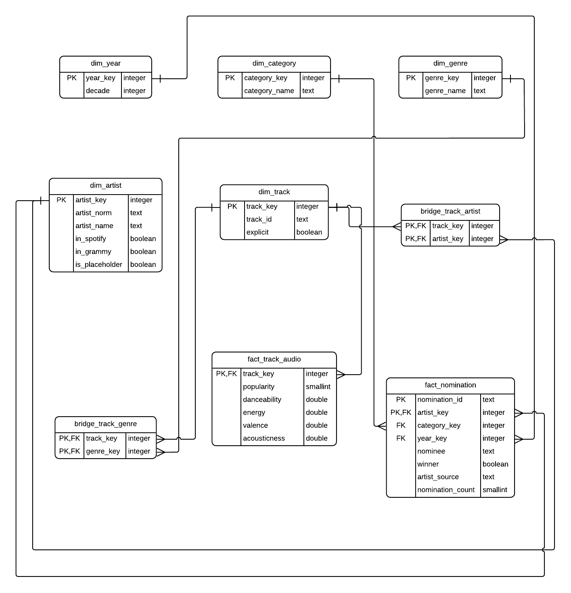

# Modelo dimensional

## 1. Proceso de negocio

Relacionar el reconocimiento de la industria musical (nominaciones a los premios Grammy) con el desempeno y el perfil de audio de las canciones en Spotify, a nivel de artista.

## 2. Grano de las tablas de hechos

| Tabla de hechos | Una fila representa | Llave primaria |
|---|---|---|
| `fact_nomination` | La participacion de un artista en una nominacion Grammy. Una nominacion con varios artistas genera varias filas. | (`nomination_id`, `artist_key`) |
| `fact_track_audio` | Una cancion unica de Spotify (`track_id`). Si aparece en varios generos se cuenta una sola vez. | `track_key` |

Decisiones asociadas al grano:

- **Popularidad repetida:** si un mismo `track_id` trae valores distintos de `popularity` entre generos (720 canciones), se toma el maximo.
- **Misma cancion con distinto `track_id`:** se tratan como canciones distintas (4657 casos). Es una limitacion declarada.
- **Nominaciones sin artista recuperable (442):** se cargan con el artista marcador "Desconocido" para que los conteos por categoria queden completos.

Las dos tablas de hechos comparten la dimension `dim_artist`, que es donde se integran Spotify y Grammy.
